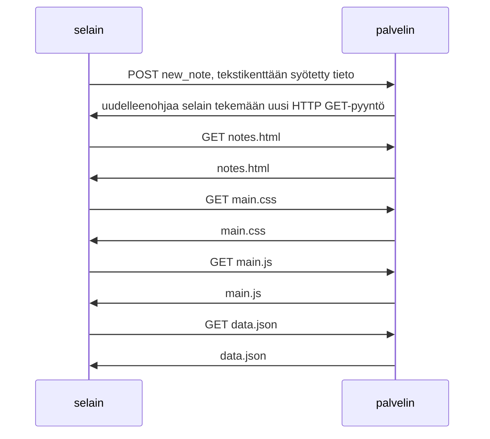

```mermaid
sequenceDiagram
    participant selain
    participant palvelin

    selain->>palvelin: POST new_note, tekstikenttään syötetty tieto
    palvelin->>selain: uudelleenohjaa selain tekemään uusi HTTP GET-pyyntö
    selain->>palvelin: GET notes.html
    palvelin->>selain: notes.html
    selain->>palvelin: GET main.css
    palvelin->>selain: main.css
    selain->>palvelin: GET main.js
    palvelin->>selain: main.js
    selain->>palvelin: GET data.json
    palvelin->>selain: data.json
```